# StaffHub — Employee Management System

A full-stack HR management application built with Java 17, Spring Boot, Spring Security, Spring Data JPA, H2, HTML, CSS, and JavaScript.

## 🌐 Live Demo

[Click here to view StaffHub](https://staffhub-employee-management.onrender.com)

## Features

### Admin
- View company dashboard and statistics.
- Manage employees and departments.
- Create HR accounts and manage staff accounts.
- Manage tasks, attendance, leave, payroll, and announcements.

### HR
- View employee records.
- Manage attendance and payroll.
- Assign tasks and manage leave requests.
- Post announcements.

### Employee
- Access a personal dashboard.
- Check in and check out.
- Apply for leave and track requests.
- View payslips, tasks, announcements, and notifications.

## Technologies
- Java 17
- Spring Boot 3.5
- Spring Security
- Spring Data JPA
- H2 Database
- HTML, CSS, JavaScript
- Maven

## Run the Application

### Prerequisites
- JDK 17 or later
- Maven 3.9 or later

### Steps
1. Clone the repository:
   ```bash
   git clone https://github.com/Harshitha0501/staffhub-employee-management.git
   ```
2. Open the project folder containing `pom.xml`.
3. Run:
   ```bash
   mvn spring-boot:run
   ```
4. Open http://localhost:8080 in your browser.

The application uses an in-memory H2 database. Data resets when the application restarts.

## Project Structure

```
src/
└── main/
    ├── java/com/staffhub/
    │   ├── config/
    │   ├── web/
    │   ├── service/
    │   ├── model/
    │   ├── repository/
    │   ├── dto/
    │   └── exception/
    └── resources/static/
        ├── index.html
        ├── app.html
        ├── css/
        └── js/

pom.xml
README.md
```

## Author

**Harshitha C.**

- GitHub: https://github.com/Harshitha0501
- Project: https://github.com/Harshitha0501/staffhub-employee-management

## 📸 Project Screenshots

### 1. Admin Dashboard
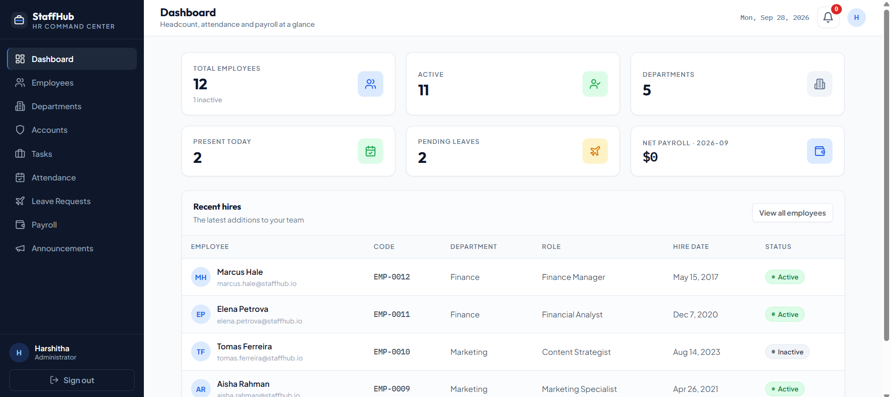

### 2. HR Dashboard
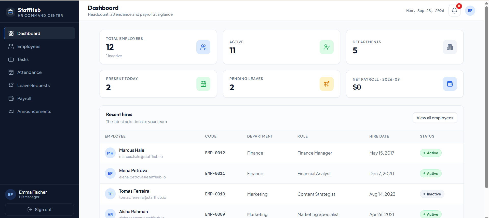

### 3. Employee Dashboard
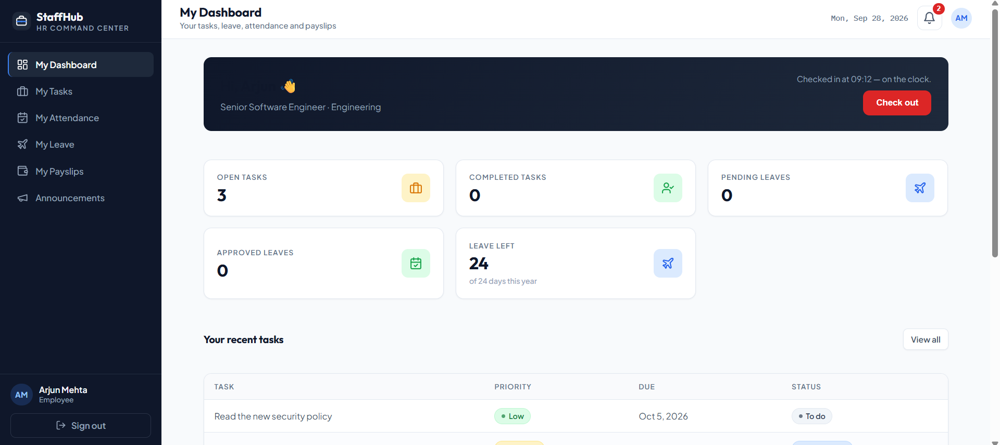

### 4. Attendance
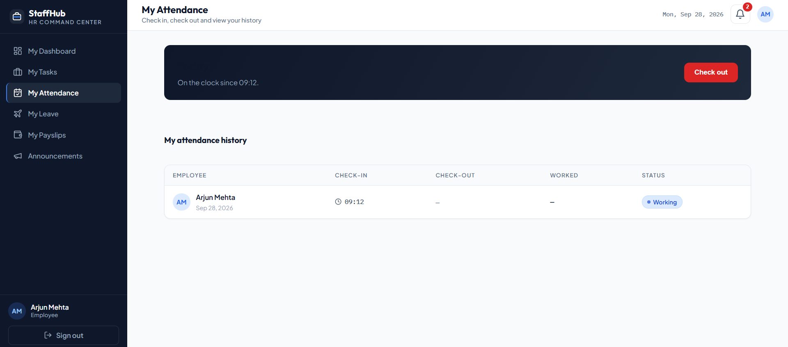

### 5. Announcements
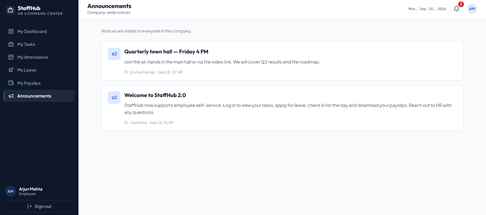

### 6. Payslip
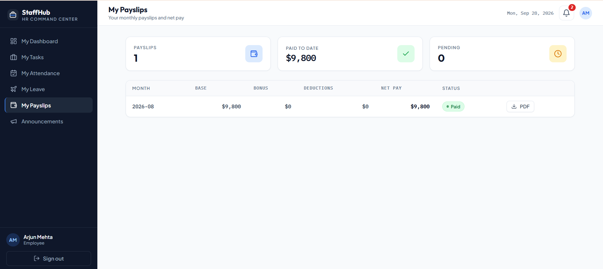

### 7. Task Assigned
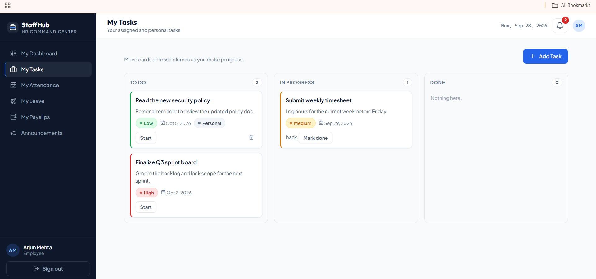

### 8. Leave Status
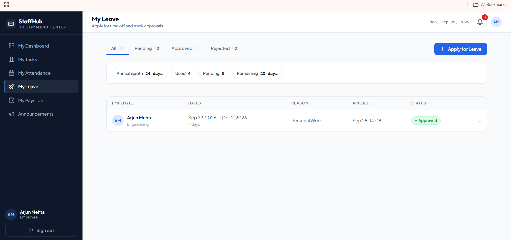

### 9. HR Leave Requests
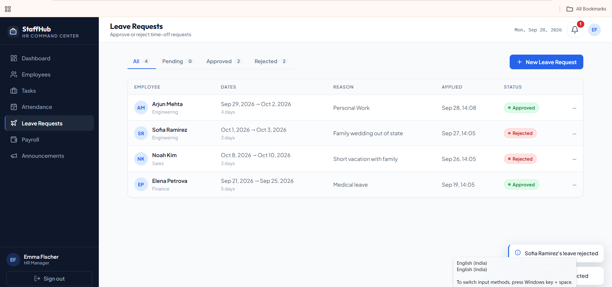

### 10. Employee Management
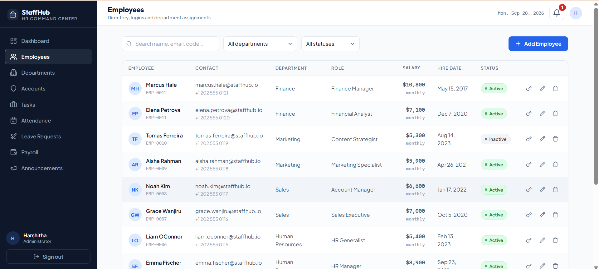

### 11. Department Management
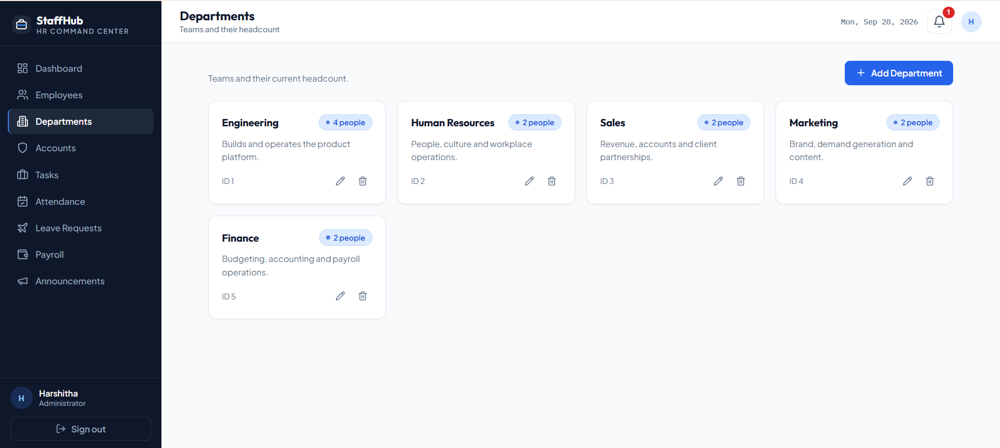
